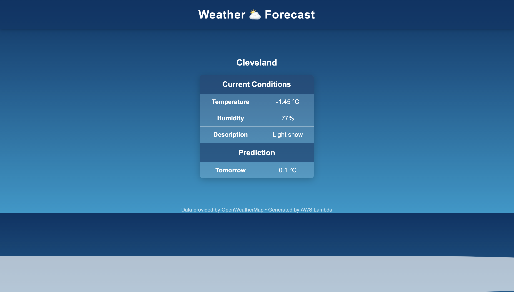

# ⛅ Weather Prediction API

Focused on expanding my skills in serverless architecture, API integration, and modular Python design, this project delivers a real-time weather forecasting application powered by AWS Lambda and OpenWeatherMap. It dynamically retrieves meteorological data for any city, processes it in the cloud, and displays it through a clean, marine-themed web interface. The goal is to deepen my understanding of cloud-based deployment, event-driven programming, and data presentation for practical, scalable applications.

---

## 📝 Project Overview

The system operates as a real-time weather monitoring and forecasting application that retrieves live meteorological data from the OpenWeatherMap API. Upon receiving a city query, the Lambda function collects key environmental parameters such as temperature, humidity, and general weather conditions, then applies a simple predictive model to estimate tomorrow’s temperature. Built with a modular Python architecture and deployed through AWS Lambda and API Gateway, the project emphasizes scalability, clean code separation, and ease of integration with other services—such as databases, IoT weather sensors, or user dashboards—for future expansion into a fully serverless climate analysis platform.

---

## 🖼️ Preview



**URL:** https://74mrlhcql9.execute-api.sa-east-1.amazonaws.com/?city=Cleveland    
(You can substitute Cleveland by any City you want).

---

## 🖥️ Project Structure
```
Weather_API/
│── lambda_function.py #All code used in lambda
│── Screenshot.png #Project view
│── README.md # Project documentation
│── LICENSE # Project documentation
│── .gitignore # Project documentation
```
---

## 🛠️ Built With

- **Backend / Cloud** – AWS Lambda, AWS API Gateway
- **Main Language** – Python
- **Data Source** – OpenWeatherMap API
- **Frontend / Website** – HTML, CSS
- **Environment Variables** – AWS Lambda Environment Configuration
- **Deployment** – AWS Console & API Gateway integration

---

## 🌐 Clone the repository
```bash
git clone https://github.com/DerikFlamel/Wheater_API.git
```
